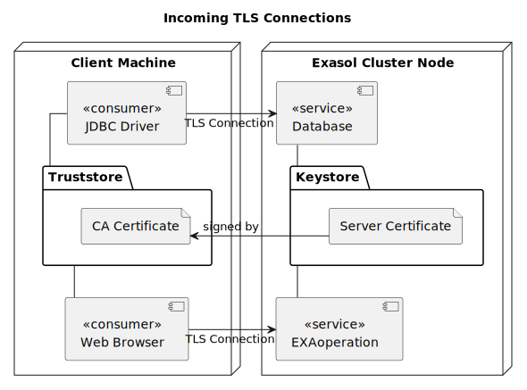
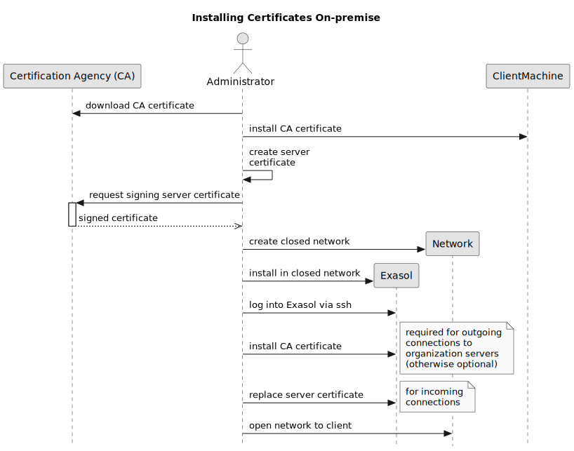

# TLS With Exasol

We covered the [basics of Transport Layer Security (TLS)](tls_introduction.md) in the first part of this series. We’ll now look at how you can use TLS with our analytics database and will focus on two areas:

1. Incoming TLS connections to Exasol services like JDBC, BucketFS or EXAOperation 
2. Outgoing connections where Exasol consumes services provided by a third party

## UDFs are Different

A User Defined Function (UDF) allows users to extend Exasol with custom functions that can be invoked directly from SQL statements. It is an extension mechanism designed to add custom logic in SQL. Let's assume your company has a complicated way of calculating a metric, but that calculation is already implemented in a Python library. You can write Python UDF, call the library inside that UDF and reuse the existing code. Exasol also supports other languages in UDFs (e.g., Java and R). We don't want to dive too deep into that topic of what you can do with UDFs here, because that is out of the scope of this article. What is relevant here is that some UDFs need to open network connections, and you usually want to secure those connections with TLS. 

In a later article in this series, we will take a close look at [using TLS inside User Defined Functions (UDFs)](tls_in_udfs.md). For now, all you need to know is that UDFs run in a sandbox, which prevents them from accessing files on the host operating system. While that makes UDFs more secure, it unfortunately means extra installation and configuration effort for users. 

Please read the in-depth article on [TLS in UDFs](tls_in_udfs.md) for more details.

## Incoming TLS Connections

[Exasol Admin](https://docs.exasol.com/db/latest/administration/on-premise/admin_interface/admin_ui_overview.htm) (Exasol 8 and later), 
[EXAOperation](https://docs.exasol.com/db/7.1/administration/aws/admin_interface/exaoperation.htm) (pre Exasol 8) and [BucketFS](https://docs.exasol.com/db/latest/database_concepts/bucketfs/bucketfs.htm) are probably the first touchpoints for users of Exasol. Exasol Admin runs on HTTPS (i.e. HTTP + TLS) by default, and BucketFS supports both HTTP and HTTPS. And, of course, HTTPS is the only suitable choice unless you’re running development tests.

This diagram shows two incoming TLS connections:

1. JDBC connection
2. Web browser connecting to Exasol Admin / EXAOperation

### The Default TLS Certificate and why you Should Replace it

To allow incoming connections from the start, Exasol comes preloaded with a default server certificate. Once you open a browser connection to that machine, your browser will display a warning that the connection isn’t secure. There are two reasons for this:

1. The certificate is self-signed, so your client does not recognize it 
2. Exasol can’t predict where the certificate is going to be hosted, so the hostname is left blank in the certificate

### The Chicken-or-the-egg Problem of Secure Connections

For a truly secure connection, you need to put in place a custom server certificate immediately after installing the cluster. Until then, you’re facing a classic chicken-or-the-egg problem. On the one hand, you need to install your own certificate to establish a trusted TLS connection. On the other hand, you need to connect to Exasol first to do this.

The graphic below shows an example of a simple on-premise installation in a single network. The organization’s CA issues a root certificate. IT administrators then place this certificate on all users’ machines in that organization. The same administrators also install the server certificate. There are multiple options, but in our example they do it via an SSH connection.

### Exasol TLS Certificate Installation (On-premise)

With on-premise setups, you can be reasonably sure that replacing the certificate takes only a few minutes — and that no one will interfere.

However, if you plan to expose one or more of Exasol’s services to the internet, you need to install a proper certificate first and then open your firewall.

Another way to circumvent the problem is to use [Secure Shell (SSH)](https://en.wikipedia.org/wiki/Secure_Shell) to add the server certificates. Cloud providers allow you to install your own SSH keys directly with the installation of virtual machines. This gives you a secure starting point for the TLS certificate setup.

## Outgoing Connections

Depending on the certificate issuer, outgoing TLS connections can either be as easy as pie or a right royal pain.

### Services With Certificates Issued by a Popular CA

If an application on your Exasol cluster wants to connect to the public application programming interface (API) of a
service, there is little to do if that service uses a certificate signed by a popular CA. These are the CAs that come
preloaded in most truststores. The TLS connection should work out of the box in this case. The TLS client can verify the
server certificate by following the certificate chain down to that known root CA.

### Services With Certificates Issued by a Custom CA

When you want to connect Exasol to a service that has a certificate issued by your own CA, you need to work a bit harder to get TLS running. There are multiple reasons:

1. If you run an Exasol cluster, all data nodes must know the custom root CA — the certificate must be installed on all nodes 
2. [User Defined Functions (UDFs) can’t access the standard truststore](tls_in_udfs.md) as they run in an environment that only gives them very restricted file system access 
3. The truststores visible to the UDF container by default are those installed with the [Script Language Containers (SLCs)](https://github.com/exasol/script-languages-release) which means that adding different certificates requires either building custom language containers or completely overriding the truststore

A Script Language Container is the environment UDFs run in. They serve as security sandbox just as much as they provide a runtime.

### Different Clients, Different Truststores

To complicate things further, different clients tend to have their own truststores.

A Linux machine has a central truststore in the `/etc` directory, typically in form of text files. Java has its own truststore and file format. At least web browsers now use the truststore that comes with the operating system.

### The Use-case Dictates the Installation

Let's look at a few typical scenarios and what you need to get them working.

#### Data Import Using the EXALoader

If all you need is running [`IMPORT`](https://docs.exasol.com/db/latest/sql/import.htm) statements, certificate installation is still pretty straight forward.

Most of the connections that you will import from are JDBC connections, and in that case you only need to install the necessary certificates in the Java truststore under `/etc/pki/ca-trust/extracted/java/cacerts` using Java's [keytool](https://docs.oracle.com/en/java/javase/11/tools/keytool.html).

##### Cluster Nodes and Truststores

Exasol distributes work across cluster nodes. While this is desirable for a high-performance database, it also means that an import can run on any of the data nodes in the cluster. Therefore, installing certificates properly for an import requires installing them on **all** cluster nodes.

There are several ways to achieve this.

* You can use [`c4` and the `confd_client`](https://docs.exasol.com/db/latest/administration/on-premise/access_management/tls_certificate.htm#Uploadcertificatechainandprivatekey) (recommended).
* You can use the XML RPC interface.
* If you only have a few nodes in the cluster, you could do it by hand.
* You could use [Distributed Shell (DSH)](https://manpages.org/dsh) to enter the command only once.
* With a larger cluster, tools like [Ansible](https://www.ansible.com/), [Chef](https://www.chef.io/) or [Puppet](https://puppet.com/) can help you script the job.
* You can write a shell script and loop through the hosts.
* Up to Exasol 7.1 you can upload certificates through ExaOperation

Please refer to the section "[Upload TLS Certificate](https://docs.exasol.com/db/latest/administration/on-premise/access_management/tls_certificate.htm)" in Exasol's online handbook for recommended practices.

#### Using TLS in User Defined Functions (UDFs)

UDFs run in a sandbox for security reasons. The main effect you should be aware of in the context of TLS is that this means UDFs cannot see the host filesystem. And that means that the certificates on the host filesystem are visible to the EXALoader, but **not** to UDFs.

Since this is a tricky topic, we have a separate article about using [TLS in UDFs](tls_in_udfs.md).

### Combining UDFs With the EXALoader

This is the point where things get really complicated. As mentioned before, UDFs run in a sandbox. So they cannot see the certificate files on the host filesystem. The EXALoader can, though.

In a scenario where you need both — let's say you want to use a Virtual Schema — you have different options.

Remember, if UDF and EXALoader only need to connect to servers that use a TLS certificate signed by a CA already included in the default truststores, no additional action is required.

If, on the other hand, you want to use your own CA, we recommend that you install the certificates twice. In the host filesystem of each data node, so that the EXALoader can see it as described in the section ["Data Import Using the EXALoader"](#data-import-using-the-exaloader). And additionally in BucketFS as described in ["TLS with UDFs"](tls_in_udfs.md).

There are other options like using symlinks from Buckets to the host file system to avoid duplication. But this has other side effects, so the cost-benefit ratio of installing the certificates twice is better.

## Conclusion

TLS with Exasol is simple as long as the CA certificates required are shipped with Exasol (and the language containers).

If you want to use certificates signed by your own CA for an Exasol cluster, you need to install those certificates. [UDFs run in a container, so special effort is needed to install certificates for them](tls_in_udfs.md).
