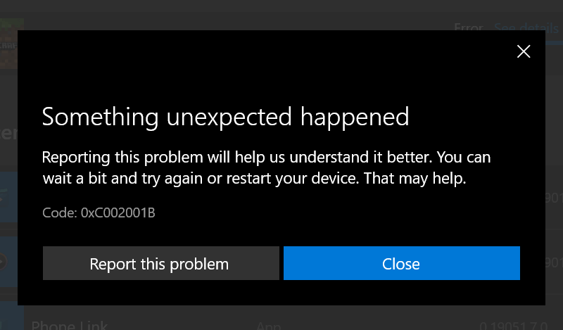
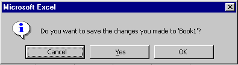
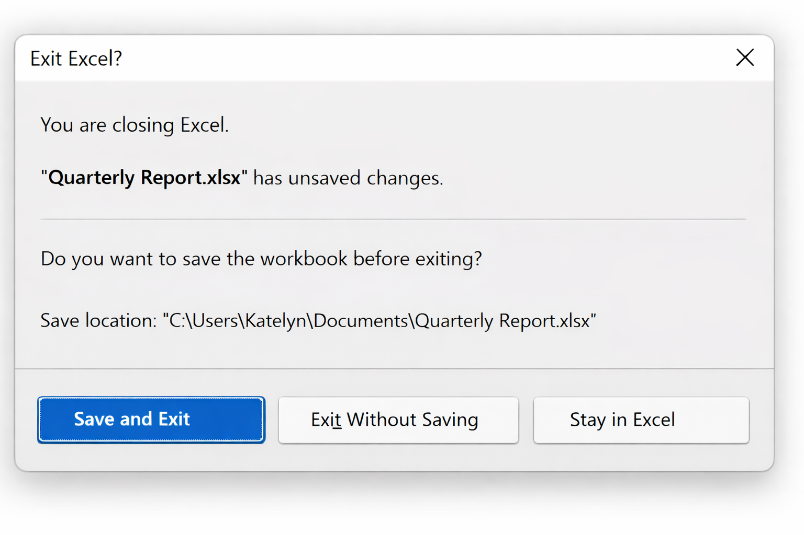
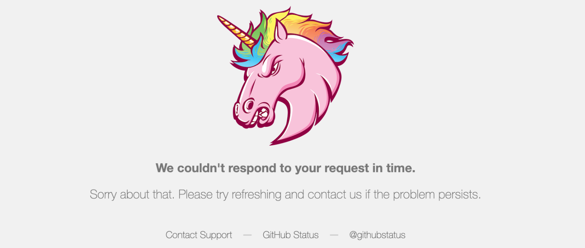
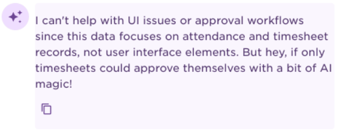

# User-centric Messages

Tell me if this situation sounds familiar to you. You are working towards a deadline, and the application you are using gets in your way with an error message that leaves you scratching your head

You started with one problem, the job at hand, and now you have two problems. The second one is the very piece of software that is supposed to help you solve the first one. Errors make users nervous and nervous people make more mistakes.

In that situation, a single poorly written message can turn struggle with the problem into frustration with the application itself.

Now flip that perspective. Do we really want to be the developers putting our users into such a situation?

We can do better than this. All it requires is investing a little bit of learning time and intentional message design.

## Use Messages Sparingly

We live in a world where there is a constant battle for the attention of a user. Developers are not marketing people. Our aim is to help and protect our users, so the first question in your design process for every message you plan in your application must be: should it exist?

Intentional software design optimizes user experience by not interrupting the flow of the user if it is not strictly necessary. Every one of us knows applications that pop up "did you know?" style messages that no one asked for. We are not going to make the same mistake.

If you come to the conclusion that you *really* need to communicate something to your user, first opt for non-invasive channels. A note in the status bar, a progress meter instead of a long list of items scrolling over the screen, or just a status indicator icon.

The more intrusive the message is, the more effort you should spend trying to avoid it. Pop-up dialogs in particular are the last option after you ruled out anything else.

> [!INFO]
> Did you notice that many popular command-line tools print out nothing if they succeed. That's not laziness on the part of the developer, but good design. [Success is expected](#the-rule-of-silence). 

## Who is the Audience

We should get the most common mistake in message design out of the way right now. No matter how hard you try, your messages will never be useful if you don't know who the audience is.

Make this always your first step in the design of any message in your application: Whom is this for?

Developers often have the tendency to write application messages for themselves, not the users. I know from first-hand experience, because I made that mistake many times in my career, and it still occasionally happens to me. Identifying the target audience of logs, feedback, and pop-ups is a part of intentional software design. You are communicating with people, not machines, and this communication must not be an afterthought.

### Different Channels, Different Readers

When you are identifying your target audience, the easiest are [UI pop-ups or status messages](#ui-messages-and-pop-ups). Those are always for the end users because they are the only ones who get to see them. I am not counting situations where an end user attaches a screenshot of such a pop-up to a help desk ticket here, because if that happens, it is a very clear indicator that the message was not helpful.

Note that an application administrator is still an end user.

The same rules apply to [command-line output](#console-output-is-still-user-communication): even if a console application feels more technical, it is still just another user interface, and its messages are still aimed at end users.

[Logs](#logs) are more complicated when it comes to the decision of who is their target audience. Under normal circumstances, users do not need to look into logs. If everything goes smoothly, they are mainly irrelevant. Only if things go south, people start to get really interested in logs. Note that I said 'people.' Monitoring tools don't mind reading boring logs, humans do. 

## Think of Everyone, Optimize for one

At this point, you may be thinking: what about support and developers? They need useful messages too. Of course, they do. But that does not make them the main audience of every message.

The design rule is straightforward: optimize for the people who are most likely to read the message first. If support and developers can also extract value from it, even better — but not at the cost of clarity for the primary audience.

In practice, that means asking two questions: Who is the *main* audience? Can I also help support and developers *without compromising* the message for that audience?

## What a Good Message Must Do

Once you decided that showing a [message is really necessary](#use-messages-sparingly), and you [identified the target audience](#who-is-the-audience), the next step is designing the content.

### Information, Warning, or Error

Messages fall roughly into one of three categories. 

Information about events or status of the application or processes is required when user actions depend on the contents. For instance, if the application starts a long-running process, a progress indicator helps users decide whether they can continue their work or have to wait for something to finish.

Error messages announce failure conditions that could not automatically be resolved. The first design goal is to avoid them, of course. If the application can mitigate an error (e.g., by retrying an interrupted network API call), we should not bother the user.

Warnings are tricky to get right. They are used when the application detects a potential problem that has no consequences for the user yet. Unfortunately, the lines between situations that require an error message and a warning are very blurry. As an example, web browsers in early two thousand displayed a warning when a server's TLS certificate expired. Users tend to ignore warnings, so today the strategy is to report an expired certificate as an error in the communication with the website. This protects less tech-savvy users and puts the necessary pressure on the website owner to fix the issue.

### Explain the Problem

When you plan a warning or error message, explain the problem to the end users in their lingo. The message must be compact, clear, and aim to help the users resolve the underlying issue. 

Phrasing the problem so that the users understand it is an extra effort. And it is not optional. If the system message is not clear to the end user, intercept it and replace it by one that is.

Bad:

> Connection manager timeout for session 156423780.
> Switching to read-only mode.

Better:

> AcmeInventory lost the connection to `yourcompany.example.com/inventory`. Information displayed in the application is read-only until the connection is up again.

### Give the Next Step

Even more than how it happened, users are interested in learning how to fix the issue.

We can improve the message above by giving them hints on what they can do.

> Please check your network setup. AcmeInventory will automatically try to connect again (next attempt in 5 minutes). For more detailed troubleshooting, please refer to https://example.com/help/troubleshooting

### Avoid Requiring Hidden Knowledge

Cryptic messages irritate users a lot. We will ignore the ones that are caused by terrible translations, because in the age of LLMs chances are we will see a lot less of those.

That leaves us with messages that require hidden knowledge to decipher them. Often they are a sign of laziness on the part of the programmer and very much avoidable.

Let's look at some examples from popular products:

> "Error 0x80004005: Unspecified error."[^5] (Microsoft Windows)

How likely is it that the developer who raised the error did not know the error condition. Not very, right? After all, they had to actively add the code in some place. What is missing here is the effort to explain what happened instead of raising an internal error code. 

> "The Finder can’t complete the operation because some data in ‘…’ can’t be read or written. (Error code -36)"[^6] (macOS Finder)

Which operation? What kind of data? What can I do about it? Apple is usually known for taking usability seriously. So the lesson learned from this example is that message design must be part of the mandatory code reviews. I can hardly imagine that his kind of sloppy phrasing could have escaped the eyes of an experienced reviewer.

[^7]

The only (weak) excuse for this particular error message might be that the error was security relevant and the authors were afraid they might disclose information that could be used to attack the system. While over-sharing is a real problem in software design, there must be a better formulation of the problem that is still secure. If I got this kind of error message, I would be very tempted to play around with the software to see if there is a vulnerability behind this enigma.

## End-User Messages

End-user messages are part of the user interface, and user interfaces exist to help people getting work done. That means we should treat every message as a potential interruption of the user's flow.

Interrupting a user is expensive. It breaks concentration, creates uncertainty, and turns attention away from the actual task. So the default position for end-user messages should be restraint. If the user can continue safely without being disturbed, let them continue.

That does not mean staying silent when something important happens. It means we need an excellent reason before we get in the way. A message should earn the attention it demands. The more intrusive it is, the stronger that reason must be.

In practice, this means preferring status indicators, progress bars, or unobtrusive hints over modal dialogs and noisy pop-ups. End-user messages should guide, warn, or protect — not constantly remind the user that the application exists.

If your marketing department asks you to promote something from within the application, remind them that getting in the user's way is the fastest route to losing their goodwill.

### UI Messages and Pop-Ups

Few GUI elements interrupt the user flow as aggressively as a pop-up dialog. As software developers, we need to use them responsibly.

More than with any other message channel, your first question must be: can I achieve the same communication with a user-friendly alternative?

To set the mood for this section, let's look at a particularly problematic example of a pop-up from an admittedly older version of Microsoft Excel.[^9]



It already starts with the wrong signal. The information icon suggests a harmless notice, but we are looking at a confirmation dialog. The application is asking the user to make a decision that will affect their work. If unsaved changes are at stake, this is no place for a cheerful little info symbol.

The buttons are even worse. 'Yes' and 'OK' are vague, and 'Cancel' is only useful if the user already understands what is going on. Modern interfaces use imperative labels to avoid ambiguity.

The buttons in the dialog above force the user to interpret the dialog first and act second. This is a recipe for human error.

The message also withholds context that the user absolutely needs. Why did this pop-up appear? Is the user closing the file, exiting the application, or triggering something else? And where exactly will 'Book1' be saved? If it was never saved before, that is not a minor detail. It is the whole point.

Even the window close button is a trap. Does clicking 'X' mean 'Cancel'? Does it dismiss the dialog? Does it continue the close operation? The user should not have to run a small experiment to find out.

Last but not least, while the default button 'Close' is safe, it is not in line with the user intent. 'Yes' would have been the correct design choice.

So this pop-up manages to do almost everything wrong at once: wrong visual category, vague buttons, missing context, and unclear consequences. It interrupts the user at a sensitive moment and then turns a simple decision into guesswork.

With modern auto-save implemented properly, the user should never have to see this dialog in the first place.

### Buttons are Part of the Message

Let's fix the mess we saw in the last dialog and focus on what users read first: the buttons.

'Save and Exit, 'Exit Without Saving' and 'Stay in Excel' tell the user what will happen if they choose a button. We are very clear here, so we prepared for the very real user impulse to immediately click fast to make the dialog got away.   



I did not mention it in the last section because it was not important there, but proper dialog design also must make sure that all buttons are keyboard-navigable. Only 'Yes' had a keyboard shortcut in the original example.

### Console Output Is Still User Communication

Console applications have a bad habit of making developers forget that they still have a user interface. The absence of windows and buttons does not change that. The command line is still a UI, and whatever an application outputs is still user communication.

This is where developer psychology often blurs the lines between application output and logs. After all, the console feels technical. We run commands there, we inspect stack traces there, and many of us are used to dumping internal details onto a terminal during development. But the fact that developers are trained at reading noisy output does not make it good design.

Users of command-line tools still need the same things as users of graphical applications: clear feedback, predictable behavior, and messages that help them reach their goal. The medium is more spartan, but the rules of proper UX design still apply.

Command-line tools also come with established conventions, and they exist for good reasons. Good CLI output is compact, readable, and intentional. A successful command should usually be quiet.

Regular output belongs on standard output, diagnostics on standard error. Messages should explain what happened in plain language, avoid implementation trivia, and help users recover when something goes wrong. If you dump internal noise onto the terminal just because it feels technical, you disrupt chained processing and make your users' lives harder.

The excellent "Command Line Interface Guidelines"[^10] summarize the mindset nicely:

> "Today, even though many CLI programs are used primarily (or even exclusively) by humans, a lot of their interaction design still carries the baggage of the past. It’s time to shed some of this baggage: if a command is going to be used primarily by humans, it should be designed for humans first."

### What End-User Messages Should Never Contain

There are also clear red lines in message design. Some information simply has no business showing up in end-user messages, no matter how convenient it may feel during development.

### Mind the OpSec

The first category is anything that weakens operational security. Passwords, access tokens, session secrets, private keys, and similar data must never appear in a message. Not even partially if that partial value helps an attacker. If such information reaches the screen, we have turned a usability problem into a security incident[^2][^3][^4].

Stack traces are also a typical OpSec issue. Especially when error messages contain stack traces, those can reveal internal knowledge about an application or its underlying infrastructure that can enable attacks. In fact, that is such a common problem that OWASP has a whole article[^1] on testing whether a stack trace slipped through the cracks. We know stack traces can be an important debug tool though. As a rule of thumb, stack traces must not reach the end users. If you log them, make sure that the log is only visible for users with administrator privileges, since they know the setup anyway. Often, though, it is better to suppress stack traces in production software completely. I know that this is a controversial standpoint, but OpSec outweighs developer convenience.

### Respect Privacy

The second category is private data never intended for that user. That includes personal information about other users, internal identifiers with business relevance, confidential document names, email addresses, customer data, and anything else the current recipient has no need and no right to see. A message should help users do their work, not accidentally leak somebody else's.

### Don't be Cute

The third category is humor that can age badly, miss the mood, or simply make the situation worse. When users see a warning or error, they are usually trying to get unstuck. This is not the best moment for a developer to test their comedy career. A joke that lands poorly makes the application feel careless. If you are in doubt, leave it out. Some people argue that end-user error messages should never contain humor at all, and they have a point.

Here is an example of an attempt at humor, that even if you allow, it does not land. I have seen the GitHub unicorn many times. And so did everyone else who frequents GitHub. I would like to replace that unicorn with a lemming.



But of course, there is always a worse example. This one is from HiBoB and straight up mocking the user.



This is a dead end with a wink.

The message tells the user what the system cannot do, but not what they should do instead. And the joke at the end only makes that worse. If a user asks about approval workflows, they need guidance, not a little comedy routine about AI magic.

A better phrasing would be:

> I can help with attendance and time sheet records. Unfortunately, I cannot help with approval workflows. Please check the user guide on how to approve time sheets or contact our support team.

That being said, if you build a chatbot into your application, back it with the user guide. Even when it cannot solve the problem directly, it can at least point the user to the right section instead of leaving them at a dead end.

## Logs

The main difference between console output or a UI message on the one hand and logs on the other is that logs are an asynchronous communication channel. Sure, you can look at a log in realtime, but that is not its main purpose.

A well-designed log allows you to find out what happened after it did.

### Humans Still Read Logs

Logs are still the main means to investigate problems with software that runs non-interactively, multi-user software, and anything that has a distributed architecture. We already discussed that error messages put users under stress. Multiply that with the number of lines in a log when you are forced to debug a problem under time pressure.

Depending on how much thought went into the log design, the debugging session will either end with a user happy that they found the root cause of an issue quickly or angry as they wasted their time deciphering gibberish. Even in the age of LLMs, your first design goal must be to serve the person reading the log.

### Target Audiences by Log-Level

Logs have multiple audiences, ranging from the end users, application administrators, system administrators, support staff all the way down to the developer who wrote the software. As a result, log designers need to deal with the unavoidable conflict of interest between those groups. Or if you prefer a more positive perspective, we need to solve an optimization problem.

Luckily, the developers of old came up with the concept of log levels to help the rest of us target our log messages correctly. A typical accepted log level hierarchy has `FATAL`, `ERROR`, `WARNING`, `INFO`, `DEBUG` and `TRACE`. There are, of course, many variants out there, but the general idea is the same.

Not only do these levels express criticality, they are also a valuable tool in our belt to decide what goes into the log message.

In most applications the default log level is `INFO` or sometimes `WARNING`. This means that if the log is printed on the console, *end users* get to see all messages with that level or higher. Consequently, end users are the target audience of these messages.

`DEBUG` is a hybrid, because there are two potential groups debugging an application: IT support or the developers. You read correctly: especially in enterprise environments, IT people are the first to look into debug logs. Their job is to unblock application users if they can. When issues reach developers too early, that is usually a sign that our messages and diagnostics are not serving support well enough.

As developers, our first instinct is often to treat anything labeled `DEBUG` as developer-only. In practice, that is frequently not the case.

At `TRACE` level, implementation-level detail is entirely appropriate.

### The Rule of Silence

A good log does not narrate everything the application does. It records what matters. The rule of silence[^8] means that expected success usually does not need a log entry. Silence is not neglect. It is restraint in service of relevance.

Every extra line competes with the important ones. If we log too much, failures, unusual conditions, and meaningful decisions get buried in routine chatter. Smaller logs are easier to scan, store, and transfer, but more importantly, they leave room for the interesting parts to stand out.

A useful rule of thumb is this: every log entry should justify its existence. If removing it makes it harder to understand a problem later, keep it. If removing it only makes the log more compact, remove it.

#### Level INFO Needs Special Care

Messages on log level `INFO` must be crafted especially carefully. This is usually the lowest log level enabled on production systems. Unlike `WARNING`, `ERROR` or `FATAL` it exists to allow logging information under normal operating conditions. And that's why it is easy to overdo it. As a rule of thumb, never log repetitive information on level `INFO`. If you feel that something should be logged, keep it compact and relevant.

Here is an example of the connection message that `remotelog-lua` adds at the first log line. Since that will be in all logs, it must be important information.

```
2026-03-13 14:21:06.004 [INFO] Connected to log receiver listening on logs.example.org:1234 with log level WARNING. Time zone is UTC+01:00.
```

Every piece of this message is intentional. There is, of course, the timestamp and the log level. But there is also context information that makes debugging easier. The log tells us who received it, what the lowest log level is that will be logged, and it gives us the timezone so that we can correlate the timestamps with other systems.

## Log Events, not Steps

Log the outcome, not the play-by-play. The connection message from the previous section is a good example. It tells the reader that the connection was established, where it leads, which log level applies, and how to interpret timestamps. That is the event that matters.

It does not narrate the internal steps that led there. Under normal conditions, readers do not need to know about every successful sub-step. If several low-level actions lead to one meaningful result, log the result.

Detailed step-by-step tracing belongs on `TRACE` or in rare cases on `DEBUG`, not in the default log.

### Text Logs

Text logs still have a place in the 21st century because they are an accessibility feature. Text logs have minimal requirements when it comes to reading them. A console and the `less` command are all you need when nothing else is at hand. A fact that is especially helpful if you have to debug via a remote shell.

If you need to work with larger text logs, `grep` and `awk` are our trusty tools that run everywhere.

Text logs are also instantly readable. They need no conversion, no interpretation UI, just a pair of eyes.

The fact that they are so simple also makes them more robust. A half-truncated text log is still half as useful as the original. An occasional line of garbage output does not invalidate the rest. In contrast, binary logs can be brittle, since depending on how the binary is structured, they are one bit-flip away from corruption.

Line-by-line text is also easy to parse. Especially in big logs, parsing speed is an important aspect of usability.

### Structured Logs

Structured logs are far superior if metadata of the log entries is important. Sure, typical text logs have timestamps, a log level, and a component identifier. But that's usually it.

When you design a distributed system, metadata becomes essential, especially correlation IDs. Parallel and concurrent processes are hard to track under normal circumstances already. If you have logs from different machines and your only chance to correlate them is a timestamp, you are in deep trouble.

Let's take a distributed database as an example. There are a number of correlation IDs that matter in a debugging situation, from general session ID over the more specific transaction ID to the number of the data node that executed a sub-operation.

Let's look at the fictional test log message below. 

```
2026-03-13 15:42:18.731 [ERROR] Import job failed while due to lost connection to 'datalake.example.com' is session 4711, transaction 9834521 node 4, chunk 18 / 34 with error 'E-IMP-3744: Remote connection timed out'
```

Now, we contrast this with a structured log in JSON.

```json
{
  "timestamp": "2026-03-13T14:42:18.731Z",
  "recorded_timezone": "UTC+01:00",
  "level": "ERROR",
  "message": "Import job failed due to lost connection",
  "remote_host": "datalake.example.com",
  "session_id": 4711,
  "transaction_id": 9834521,
  "data_node_id": 4,
  "job": {
    "job_type": "IMPORT_FROM_DATALAKE",
    "total_chunks": 34,
    "current_chunk": 18
  },
  "error": {
    "code": "E-IMP-3744",
    "message": "Remote connection timed out"
  }
}
```

The funny part is that even if you just use `less`, the message gets more readable. It is clear that if you want to combine the logs from multiple nodes, the structured log is by far superior.

## Message Design Is Iterative

"Get it right the first time" is what we all dream of, but there is a reason, iterative software development is such a big thing. Like all other aspects of engineering, there are best practices you can follow from the beginning and still improve on the results over time by incorporating feedback. 

### Review Messages Like Other Product Decisions

There is an occupation called 'technical writer.' These people are trained in communicating technical information to users. A job that is a lot harder than it looks because it requires that the tech writers put themselves into the shoes of the users. If your organization has tech writers, get their support.

They can take over message design, but in the spirit of "teach a man to fish" it is better when they train the developers to write their own messages and review the results.

In the absence of tech writers, UX designers or at least seasoned software developers should always review the design and code.

### Learn from Support Cases and User Feedback

Let's face it. Sometimes the first version of a message is not good enough. And then there are the ones that you have to change a couple of times until you get it right.

Here is an early example from Exasol's Virtual Schema that went through a couple of iterations until it was clear to the users what the error meant.

> F-VSD-5: The current version of virtual-schemas does not support LIKE and NOT LIKE as post-selection.

We got a lot of customer questions around this, and we cannot blame them. The error message neither gives them any context to work with, nor does it explain what the "post-selection" is. It is a typical case of a programmer assuming that the users know the internals of the application. Why should they?

The next iteration was already better:

> F-VSD-5: For efficiency reasons virtual schemas support operators LIKE and NOT LIKE only for column SOURCE_REFERENCE.
>
> Mitigation:
>
> Please change your query and wrap it in an outer SELECT statement that can use the operator LIKE for other columns as well.
 
Now the users knew what caused the issue and how to prevent it. Unfortunately, after they cleared that hurdle, they sometimes ran into a subtle secondary issue caused by the optimizer, so in yet another iteration we added the following instructions:

> Add a high limit (e.g., `LIMIT 1E15`) to the outer SELECT to prevent the optimizer from pushing the filter down.
> 
> See also: https://github.com/exasol/virtual-schemas/blob/main/doc/user_guide/faq.md

As you can see, the complete error message is quite long now. But that is necessary in this case. Our aim is to help the users reach their goal. Complex problems sometimes have no simple solution.

If you paid close attention to the article to this point, you will ask "shouldn't the application be improved to make this error go away?"

You are right. But budget always is a constraint on how much user experience you can squeeze out of a product. In this case the changes required to remove the limitation or at least to automatically rewrite the user query are too extensive for the given budget. In this case enabling the users to overcome the limitation is the second-best option.

## Checklist

The following checklist can help you remember the important aspects of message design during conception and review.

- [ ] Check whether a message is needed.
- [ ] Choose the least intrusive channel.
- [ ] Identify and optimize for the audience.
- [ ] Explain problem, consequence, and next step.
- [ ] Use clear language without hidden knowledge.
- [ ] Make actions explicit and accessible.
- [ ] Expose neither secrets nor private data.
- [ ] Keep logs relevant, human-readable, and sparse.

## Conclusion

Messages are part of intentional software design. They must be user-centric and since the main users are people, human-centric.
Noise, ambiguity, and misalignment of the target audience get in the way of the user experience.

If in doubt, go back to the [checklist](#checklist) and design the message your user actually needs.

<!-- Bibliography -->

[^1]: OWASP Foundation. 2026. **Testing for Stack Traces — Web Security Testing Guide (WSTG-ERRH-02)**. https://owasp.org/www-project-web-security-testing-guide/v41/4-Web_Application_Security_Testing/08-Testing_for_Error_Handling/02-Testing_for_Stack_Traces

[^2]: Charles Fol. 2021-01-12. **Laravel <= v8.4.2 debug mode: Remote code execution (CVE-2021-3129)**. https://blog.lexfo.fr/laravel-debug-rce.html

[^3]: Dawid Moczadło. 2023-10-24. **Escalating debug mode in Django to RCE, SSRF, SQLi**. https://blog.vidocsecurity.com/blog/escalation-of-debug-mode-in-django

[^4]: Greg Scharf. 2023-04-09. **LFI to RCE in Flask Werkzeug Application**. https://blog.gregscharf.com/2023/04/09/lfi-to-rce-in-flask-werkzeug-application/

[^5]: Microsoft Learn. 2024-05-24. **Error Code 0x80004005 unspecified**. https://learn.microsoft.com/en-us/answers/questions/3858444/error-code-0x80004005-unspecifed

[^6]: Apple Community. 2026-02-17. **Finder can't complete the operation**. https://discussions.apple.com/thread/255975031

[^7]: Eddie Mendoza Jr. 2025-04-20. **Fix Microsoft Store Error Code 0xC002001B on Windows PC**. https://www.windowsdispatch.com/fix-microsoft-store-error-code-0xc002001b-windows-10-11/**

[^8]: Eric S. Raymond. 2003. **The Art of Unix Programming, Chapter 1: Philosophy Matters**. Rule of Silence: "When a program has nothing surprising to say, it should say nothing." http://www.catb.org/esr/writings/taoup/html/ch01s06.html

[^9]: Georg P. Loczewski. n.d. **User Interface Hall of Shame**. http://hallofshame.gp.co.at/

[^10]: Aanand Prasad, Ben Firshman, Carl Tashian, and Eva Parish. n.d. **Command Line Interface Guidelines**. https://clig.dev/